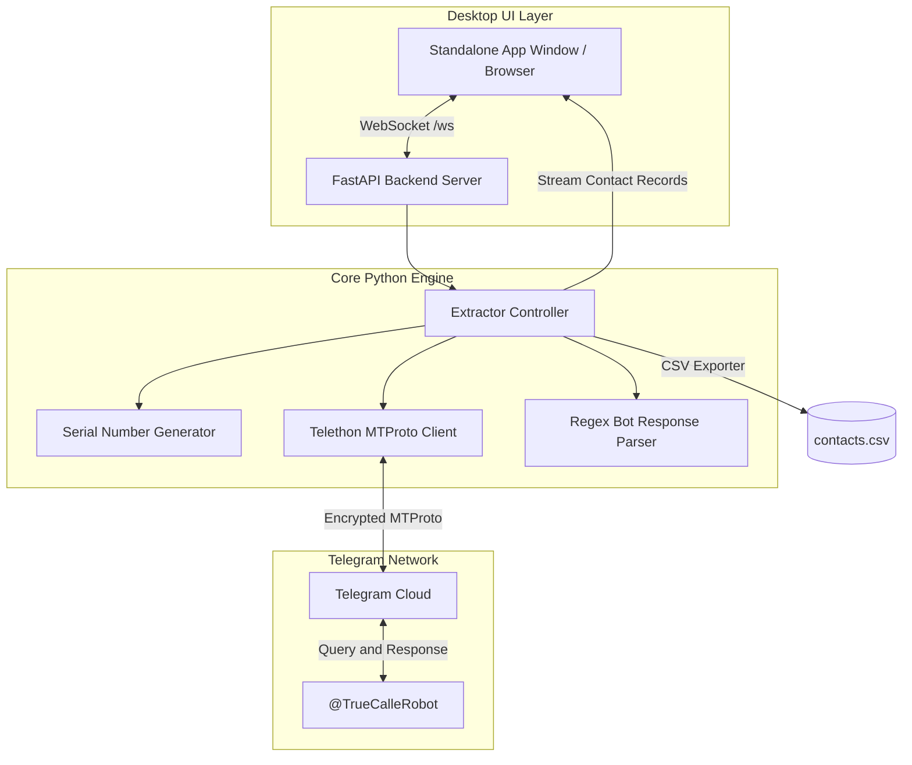

<div align="center">

# ⚡ Truecaller BD Serialized Extractor

**Automated Intelligence Extraction & Serialized Number Discovery Engine**

[](https://www.python.org/)
[](https://fastapi.tiangolo.com/)
[](https://github.com/LonamiWebs/Telethon)
[](https://developer.mozilla.org/en-US/docs/Web/API/WebSockets_API)
[](https://github.com/al-fahad-bd/telegram-data-extraction)

<br>

<p align="center">
  A high-performance automated pipeline for extracting caller identity records across serialized Bangladeshi mobile phone numbers via Telegram's Truecaller bot. Features an ultra-modern glassmorphic desktop graphical interface, real-time WebSocket telemetry, anti-flood delay randomization, and instant CSV export.
</p>

[Key Features](#-key-features) •
[GUI Showcase](#-modern-glassmorphic-interface) •
[Quick Start](#-quick-start) •
[Usage Modes](#-usage-modes) •
[Architecture](#-architecture) •
[Operator Presets](#-supported-operators) •
[License](#-license)

---

</div>

## 🌟 Key Features

- **⚡ Serial Number Generator**: Automatically generates incremental sequences of valid Bangladeshi mobile numbers based on operator prefixes (`+88017`, `+88019`, `+88018`, `+88016`, `+88015`, `+88013`, `+88014`).
- **🖥️ Ultra-Modern Glassmorphic Desktop GUI**:
  - Standalone borderless desktop window powered by native WebKit/Chromium engine.
  - Live animated **Radar Scanner** with pulse animations.
  - Real-time countdown timer and batch completion progress bar.
  - Dynamic metric counters: *Total Scanned*, *Names Found*, *Not Found*, *Success Rate %*.
- **📊 Real-Time Results Table**:
  - Live streaming row additions with smooth entrance animations.
  - Instant client-side search filtering by name, number, or carrier.
  - Direct deep-links to **WhatsApp** (`wa.me`) and **Telegram** (`t.me`).
- **💾 One-Click CSV Export**: Cleanly download all parsed contact attributes formatted for CRM and analytics.
- **🛡️ Anti-Flood Protection**: Configurable randomized delay intervals (e.g. 20–30s) with organic jitter to avoid bot rate limits.
- **🔌 Multi-Mode Architecture**:
  - **Modern GUI** (Default, web-based standalone app window)
  - **Classic Tkinter GUI** (`--tk`, with macOS Cocoa Dark Mode redraw patch)
  - **Headless Terminal CLI** (`--cli`, ideal for servers and SSH sessions)

---

## 🎨 Modern Glassmorphic Interface

```
+-----------------------------------------------------------------------------------+
|  ⚡ Truecaller BD Extractor     🤖 @TrueCalleRobot            ● Online: User (@user)|
+-----------------------------------------------------------------------------------+
|  [⚙️ Generator & Configuration]               [📡 Live Scanning Radar]             |
|  Starting No: [+8801795664120 ]               Radar: ● SCANNING IN PROGRESS...    |
|  Operator:    [Grameenphone (017) v]          Target: +8801795664125              |
|  Batch Count: [20             ]               Progress: 8 / 20 (40%) [====>     ] |
|  Delay (s):   [20] to [30     ]               Next Query In: 18s                  |
|                                                                                   |
|  Single Lookup: [+88018XXXXXXXX] [🔍 Check]                                      |
|  [▶ Start Automation]   [⏸ Pause]   [⏹ Stop]                                     |
+-----------------------------------------------------------------------------------+
|  [ 🔢 TOTAL: 20 ]   [ 👤 FOUND: 14 ]   [ 🚫 NOT FOUND: 6 ]   [ 📈 RATE: 70.0% ]   |
+-----------------------------------------------------------------------------------+
|  📋 Extracted Contact Records            [🔍 Search...]   [💾 Export CSV] [🗑 Clear] |
|  +----+----------+----------------+-------------------+---------------+-----------+
|  | #  | Time     | Phone Number   | Name              | Carrier       | Status    |
|  +----+----------+----------------+-------------------+---------------+-----------+
|  | 1  | 14:32:05 | +8801795664120 | Shiam Cpi Dpi     | Grameenphone  | Found     |
|  | 2  | 14:32:31 | +8801795664121 | Not Found         | Grameenphone  | Not Found |
|  +----+----------+----------------+-------------------+---------------+-----------+
|  🖥️ Real-Time Activity Stream                                                     |
|  [14:32:05] [SUCCESS] Extracted: Shiam Cpi Dpi | Grameenphone (Found)             |
|  [14:32:06] [INFO] Antiflood delay: waiting 25s before next query...              |
+-----------------------------------------------------------------------------------+
```

---

## 🏗️ Architecture



---

## 🚀 Quick Start

### 1. Clone the Repository
```bash
git clone https://github.com/al-fahad-bd/telegram-data-extraction.git
cd telegram-data-extraction
```

### 2. Create and Activate Virtual Environment
```bash
python3 -m venv venv
source venv/bin/activate  # On Windows: venv\Scripts\activate
```

### 3. Install Dependencies
```bash
pip install -r requirements.txt
```

### 4. Configure Telegram Credentials
Obtain your Telegram `API_ID` and `API_HASH` from [my.telegram.org](https://my.telegram.org):

1. Create a `.env` file in the root directory:
```env
TELEGRAM_API_ID=your_api_id_here
TELEGRAM_API_HASH=your_api_hash_here
```

2. On first run, Telethon will prompt you to authenticate your Telegram phone number and enter the confirmation OTP code. The session is securely saved locally in `sessions/telegram.session`.

---

## 💻 Usage Modes

### 1. Default Mode (Modern Desktop GUI)
Launches the full glassmorphic desktop interface in an isolated application window:
```bash
python main.py
```
*(If Google Chrome is installed, it opens automatically in borderless application mode `--app`; otherwise, it launches in your default system browser.)*

### 2. Classic Desktop GUI (Tkinter)
Launches the native Tkinter desktop interface with the macOS Cocoa Dark Mode repaint patch:
```bash
python main.py --tk
```

### 3. Headless Terminal CLI
Direct interactive terminal session without any graphical interface:
```bash
python main.py --cli
```

---

## 📱 Supported Operators

The built-in serializer automatically validates prefix lengths, standardizes international numbers (`+880`), and formats serial sequences for all official Bangladeshi telecom providers:

| Operator | Dialing Codes | Serial Prefix Format |
| :--- | :--- | :--- |
| **Grameenphone** | `017`, `013` | `+8801700000000`, `+8801300000000` |
| **Robi Axiata** | `018` | `+8801800000000` |
| **Banglalink** | `019`, `014` | `+8801900000000`, `+8801400000000` |
| **Airtel Bangladesh** | `016` | `+8801600000000` |
| **Teletalk** | `015` | `+8801500000000` |

---

## 📁 Extracted Data Schema

Exported CSV files contain the following structured fields:

| Field Name | Type | Description |
| :--- | :--- | :--- |
| `phone_number` | `String` | E.164 international format (e.g., `+88017XXXXXXXX`) |
| `name` | `String` | Discovered caller name (or `Not Found`) |
| `carrier` | `String` | Network telecom operator name |
| `country` | `String` | Country of registration (`Bangladesh`) |
| `has_whatsapp` | `Boolean` | Direct WhatsApp account presence |
| `has_telegram` | `Boolean` | Direct Telegram account presence |
| `status` | `String` | `Found`, `Not Found`, `Rate Limited`, etc. |
| `timestamp` | `DateTime` | Timestamp of extraction (`YYYY-MM-DD HH:MM:SS`) |
| `raw_text` | `String` | Unprocessed bot reply text |

---

## 📂 Project Structure

```
telegram-data-extraction/
├── main.py                     # Unified multi-mode application launcher
├── requirements.txt            # Python dependencies (FastAPI, Telethon, etc.)
├── .env                        # Local Telegram API secrets (git-ignored)
├── sessions/                   # Saved Telegram MTProto session files
├── src/
│   ├── generator.py            # BD phone number cleaner, validator & serializer
│   ├── parser.py               # Robust regex parser for bot responses
│   ├── bot_handler.py          # Telethon conversation & edit handler
│   ├── telegram_client.py      # Telethon client initialization & credentials
│   ├── web_gui.py              # FastAPI server, WebSocket manager & desktop launcher
│   ├── gui_app.py              # Classic Tkinter desktop application
│   └── static/
│       ├── index.html          # Semantic modern UI layout
│       ├── style.css           # Glassmorphism dark theme & animations
│       └── app.js              # Real-time WebSocket synchronization client
└── tests/
    └── test_modules.py         # Unit tests for generator and parser
```

---

## ⚠️ Disclaimer

> This project is designed strictly for educational, security auditing, and research purposes. Please ensure compliance with Telegram's Terms of Service and applicable local privacy regulations when gathering public profile intelligence. The developers do not endorse abuse or mass unsolicited messaging.

---

## 👤 Author

**Al Fahad**
- GitHub: [@al-fahad-bd](https://github.com/al-fahad-bd)
- Project Repository: [telegram-data-extraction](https://github.com/al-fahad-bd/telegram-data-extraction)

---

<div align="center">
  <sub>Built with ❤️ using Python, FastAPI, and Telethon. If you find this project useful, consider giving it a ⭐!</sub>
</div>
